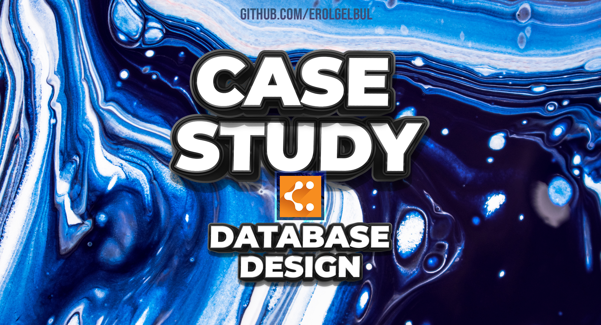

<!-- ABOUT THE PROJECT -->
## Description

Designing a relational database involves creating a structure that organizes and stores data in a way that makes it easy to retrieve and manage. To begin the process, you'll need to review the given specification that outlines the requirements for the database.

The first step in the design process is to identify the entities that will be stored in the database. Entities are the things that the database will be keeping track of, such as customers, products, or orders. Once you have a list of entities, you'll need to determine the attributes that describe each entity. For example, a customer entity might have attributes like name, email address, and phone number.

After you've identified the entities and their attributes, the next step is to create a table for each entity. Each table should have columns for each of the attributes that you identified earlier. You'll also need to choose a primary key for each table, which is a unique identifier that distinguishes each record in the table.

The next step is to establish relationships between the tables. Relationships describe how the entities are connected to each other. There are three types of relationships: one-to-one, one-to-many, and many-to-many. To establish relationships, you'll need to define foreign keys, which are columns that reference the primary key of another table.

Once you've established the relationships between the tables, you can begin to normalize the database. Normalization is the process of organizing the data in a way that reduces redundancy and improves data integrity. There are several normal forms, with each higher normal form indicating a higher level of normalization.

Finally, you'll need to write queries that allow you to retrieve and manipulate the data in the database. Queries are written using a query language, such as SQL. You can use queries to filter and sort data, perform calculations, and join data from multiple tables.

Overall, designing a relational database involves careful planning and attention to detail. By following the steps outlined in this documentation, you'll be able to create a well-organized and efficient database that meets the requirements of the given specification.

(<a href="#top">back to top</a>)

<!-- TOOL -->
## Design Tool

Diagramming Application: [Lucid Chart](https://www.lucidchart.com/pages/)

(<a href="#top">back to top</a>)

<!-- DESIGN PROCESS -->
## Design Process

Please read the `specification.docx` file to start.

1. Construct the base entities.

2. Add the event log.

3. Instead of the event log, maybe we can provide a audit log, which will be
   outside of this system (another database) to keep log information. Due to
   deletion of `Post` or `User` data.

4. Add commenting functionality. Making sure the diagram is always at 3NF.

5. Finally, add the rating functionality to the design, given from the specification.

(<a href="#top">back to top</a>)

<!-- CONTRIBUTING -->
## Contributing

If you would like to add any extra features, feel free to fork and create a pull request. Thank you!

1. Fork the Project
2. Create your Feature Branch (`git checkout -b feature/AmazingFeature`)
3. Commit your Changes (`git commit -m 'Add some AmazingFeature'`)
4. Push to the Branch (`git push origin feature/AmazingFeature`)
5. Open a Pull Request

(<a href="#top">back to top</a>)

<!-- CONTACT -->
## Contact

Erol Gelbul - [Website](http://www.erolgelbul.com)

Project Link: [Blog Database Design](https://github.com/ErolGelbul/blog_db_design)

(<a href="#top">back to top</a>)

